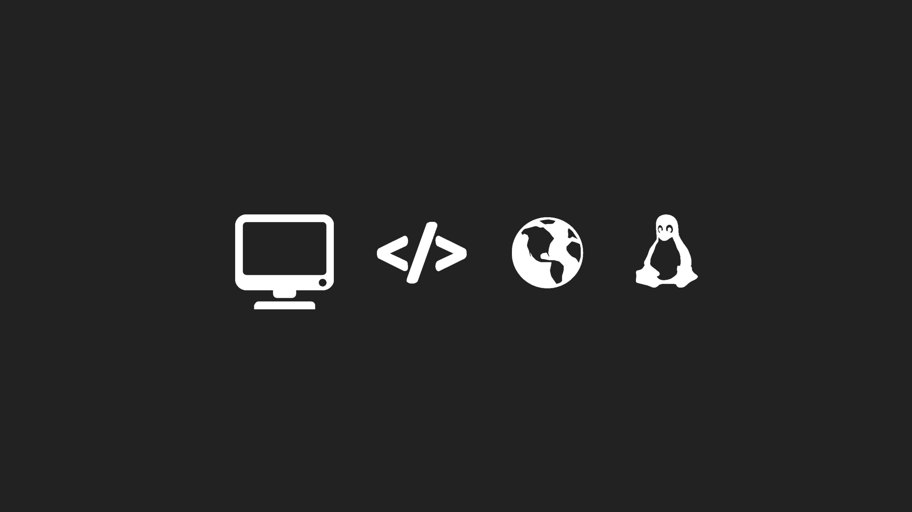

<p align="center">
  
</p>

<h1 align="center">GNU/LINUX</h1>
<p align="center">S.O | Shell Scripting | Networking | Servers | Automation | Security | Virtualization | Storage</p>

### Professional Technical Portfolio | Long-Term Engineering Repository

## Overview

Este repositorio representa un dominio especializado dentro de mi portafolio técnico profesional, enfocado en la ingeniería de sistemas Linux, administración de plataformas empresariales, automatización, servicios de infraestructura y tecnologías utilizadas en entornos Enterprise.

Su contenido documenta la aplicación práctica de conocimientos mediante laboratorios, proyectos, documentación técnica y soluciones orientadas a escenarios reales de infraestructura Linux.

---

## Purpose

El propósito de este repositorio es desarrollar competencias profesionales relacionadas con la administración, implementación, automatización y mantenimiento de sistemas Linux utilizados en ambientes empresariales.

Los principales objetivos incluyen:

- Documentar soluciones técnicas.
- Desarrollar laboratorios prácticos.
- Implementar proyectos orientados a escenarios reales.
- Aplicar buenas prácticas de administración Linux.
- Construir evidencia técnica del aprendizaje continuo.

## Scope

Este repositorio comprende el estudio, documentación y desarrollo práctico de tecnologías relacionadas con sistemas operativos Linux, administración de servidores, automatización, servicios empresariales y buenas prácticas utilizadas en entornos profesionales.

El alcance del proyecto incluye los siguientes dominios tecnológicos:

---

### Red Hat

Administración de plataformas Enterprise Linux basadas en Red Hat.

Áreas principales:

- Red Hat Enterprise Linux (RHEL)
- System Administration
- Enterprise Services
- Security
- Automation
- Certification Learning Paths

---

### Debian

Documentación y administración de sistemas basados en Debian.

Áreas principales:

- System Administration
- Package Management
- Services
- Networking
- Security

---

### Ubuntu

Administración y configuración de plataformas Ubuntu.

Áreas principales:

- Desktop & Server Administration
- Package Management
- Services
- Networking
- Security

---

### SUSE

Administración de distribuciones empresariales SUSE Linux.

Áreas principales:

- Enterprise Administration
- Services
- Security
- System Management

---

### Rocky Linux

Administración de plataformas Rocky Linux orientadas a entornos Enterprise.

Áreas principales:

- Enterprise Linux
- System Administration
- Services
- Security

---

### AlmaLinux

Administración de plataformas AlmaLinux para ambientes empresariales.

Áreas principales:

- Enterprise Linux
- System Administration
- Services
- Security

---

### Shell Scripting

Automatización de tareas mediante Shell Script.

Áreas principales:

- Bash Scripting
- Process Automation
- Task Scheduling
- System Administration Scripts

---

### Enterprise Services

Implementación y administración de servicios empresariales sobre Linux.

Áreas principales:

- DNS
- DHCP
- Web Services
- File Services
- Remote Access
- Network Services

---

### System Security

Buenas prácticas para fortalecer y proteger sistemas Linux.

Áreas principales:

- Hardening
- Access Control
- Permissions
- SELinux
- AppArmor
- SSH Security
- Firewall Configuration

---

### Automation

Automatización de tareas administrativas y operativas.

Áreas principales:

- Bash
- Cron
- System Automation
- Administrative Tasks

---


### Networking

Administración de redes en sistemas Linux.

Áreas principales:

- TCP/IP
- Network Configuration
- DNS
- DHCP
- Routing
- Firewall
- SSH
- Network Troubleshooting

---

### Storage

Administración de almacenamiento en sistemas Linux.

Áreas principales:

- Partitions
- Filesystems
- LVM
- RAID
- Mount Management
- Storage Administration

---

### Monitoring

Supervisión y monitoreo de servidores Linux.

Áreas principales:

- System Monitoring
- Performance Analysis
- Logs
- Resource Monitoring
- Availability Monitoring

---

## Out of Scope

Los siguientes dominios tecnológicos mantienen repositorios independientes:

- Microsoft Technologies → Microsoft Engineering
- Infrastructure Technologies → Infrastructure Engineering
- Database Technologies → Database Engineering
- Cybersecurity Operations → Cybersecurity Engineering

## Repository Architecture

La estructura del repositorio está organizada por dominios tecnológicos.

Cada dominio mantiene de forma independiente su documentación, laboratorios, proyectos, recursos y rutas de aprendizaje.

Ejemplo:

```text
linux-engineering/

├── red-hat/
├── debian/
├── ubuntu/
├── rocky-linux/
├── almalinux/
├── shell-scripting/
├── linux-services/
├── linux-networking/
├── storage/
├── security/
├── monitoring/
├── virtualization/
├── automation/
├── performance/
└── troubleshooting/
```

---


